# WEBFLOW TEMPLATE FOLDER - READ-ONLY POLICY

## 🚨 CRITICAL NOTICE: READ-ONLY FOLDER

The `Modelo - Webflow` folder in this repository is **STRICTLY READ-ONLY** and must never be modified directly.

## 📁 Folder Identification

**Protected Folder:** `Modelo - Webflow/`

This folder contains:

- `index.html` - Main Webflow template
- `untitled.html` - Additional template page
- `css/` - Webflow-generated stylesheets
- `fonts/` - Font assets
- `images/` - Image assets
- `js/` - Webflow-generated JavaScript

## 🔒 Access Restrictions

### ✅ ALLOWED ACTIONS

- **READ** files for reference and analysis
- **COPY** content for understanding HTML structure
- **REFERENCE** CSS classes and component organization
- **ANALYZE** layout patterns and component hierarchy

### ❌ FORBIDDEN ACTIONS

- **NO EDITING** of any files within this folder
- **NO ADDING** new files to this folder
- **NO DELETING** files from this folder
- **NO MOVING** or renaming files in this folder
- **NO COMMITTING** changes to this folder (unless it's a complete Webflow export)

## 🔄 Proper Workflow

### When You Need to Make Changes

1. **Make changes in Webflow platform** (the source of truth)
2. **Export the updated files** from Webflow
3. **Replace the entire `Modelo - Webflow` folder** with the new export
4. **Commit the complete folder replacement** as a single atomic operation

### Development Process

```mermaid
graph LR
    A[Webflow Platform] --> B[Export Files]
    B --> C[Replace Entire Folder]
    C --> D[Commit to Repository]
    D --> E[Deploy/Use in Development]

    F[❌ Direct File Editing] -.-> G[❌ Conflicts & Issues]
```

## 📋 Purpose Statement

This folder serves exclusively as:

- **Reference material** for developers to understand HTML structure
- **Component documentation** for layout patterns
- **CSS class reference** for styling consistency
- **Asset inventory** for images, fonts, and JavaScript dependencies

## 🛡️ Implementation Details

### File Protection Measures

1. **Git Tracking:** The folder is tracked but protected through policy
2. **Documentation:** This policy document and folder-specific README
3. **Code Review:** Any changes to this folder require explicit approval
4. **Automated Checks:** Scripts validate folder integrity

### Developer Guidelines

- If you need to understand a component structure, examine the HTML files in this folder
- If you need to replicate a layout, reference the CSS classes used
- If you need to add new functionality, implement it outside this folder
- If Webflow changes are needed, use the Webflow platform directly

## ⚠️ Violation Consequences

Modifying files in this folder directly can lead to:

- **Merge conflicts** when new Webflow exports are imported
- **Loss of changes** when the folder is replaced with Webflow exports
- **Inconsistency** between Webflow platform and repository
- **Deployment issues** due to mismatched files

## 🔧 Emergency Procedures

### If Accidental Changes Occur

1. **Stop immediately** - don't make additional changes
2. **Revert changes** using git: `git checkout HEAD -- "Modelo - Webflow/"`
3. **Re-export from Webflow** if the original files are corrupted
4. **Inform the team** about the incident

### If You Must Make Urgent Changes

1. **Document the emergency** in a ticket or issue
2. **Make minimal changes** with clear comments
3. **Export from Webflow ASAP** to restore consistency
4. **Replace your emergency changes** with the official Webflow export

## 📚 Related Documentation

- [Project README](./README.md) - General project documentation
- [Modelo - Webflow/README.md](./Modelo%20-%20Webflow/README.md) - Folder-specific warnings
- [Development Workflow](./docs/) - Development process documentation

## 📞 Questions & Support

If you need to:

- Make changes to the Webflow template → Use Webflow platform
- Understand component structure → Examine files in read-only mode
- Add new features → Implement outside the Webflow folder
- Report issues with this policy → Contact the development team

---

**Remember: This folder is the exported output from Webflow, not the source. The Webflow platform is the single source of truth.**
