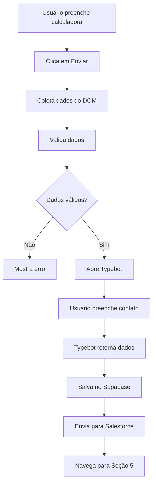

# Documentação Técnica - Fluxo de Dados da Calculadora Reino Capital

## Índice

1. [Visão Geral do Sistema](#1-visão-geral-do-sistema)
2. [Fluxo Completo de Dados](#2-fluxo-completo-de-dados)
3. [Coleta de Dados da Interface](#3-coleta-de-dados-da-interface)
4. [Estruturas de Dados](#4-estruturas-de-dados)
5. [Integração com Typebot](#5-integração-com-typebot)
6. [Salvamento no Supabase](#6-salvamento-no-supabase)
7. [Integração com Salesforce](#7-integração-com-salesforce)
8. [Módulos e Arquivos](#8-módulos-e-arquivos)
9. [Correções Implementadas](#9-correções-implementadas)
10. [Debugging e Testes](#10-debugging-e-testes)

---

## 1. Visão Geral do Sistema

A calculadora Reino Capital é um sistema multi-etapas que coleta dados financeiros do usuário, processa através de diferentes integrações e salva em múltiplos sistemas.

### Arquitetura do Sistema

```
Interface da Calculadora (DOM)
    ↓
Coleta de Dados (JavaScript)
    ↓
Validação de Dados
    ↓
Typebot (Coleta de Contato)
    ↓
Supabase (Armazenamento Principal)
    ↓
Salesforce (CRM)
```

### Tecnologias Envolvidas

- **Frontend**: HTML/CSS/JavaScript (Webflow)
- **Chatbot**: Typebot
- **Database**: Supabase (PostgreSQL)
- **CRM**: Salesforce
- **Padrão**: IIFE (Immediately Invoked Function Expression)

---

## 2. Fluxo Completo de Dados

### 2.1 Sequência de Execução

1. **Usuário preenche calculadora** (Seções 1-4)
2. **Clica em "Enviar"** (Seção 4)
3. **Sistema coleta dados** do DOM
4. **Valida dados** coletados
5. **Abre Typebot** com variáveis pré-preenchidas
6. **Usuário preenche contato** no Typebot
7. **Typebot envia dados** de volta
8. **Sistema salva no Supabase** com dados completos
9. **Sistema envia para Salesforce** (paralelo)

### 2.2 Diagrama de Fluxo



---

## 3. Coleta de Dados da Interface

### 3.1 Elementos DOM Principais

#### Patrimônio
```html
<input id="currency" data-currency="true" is-main="true" class="currency-input">
```

#### Ativos Selecionados
```html
<div class="patrimonio_interactive_item" ativo-product="CDB" ativo-category="Renda Fixa">
  <div class="active-produto-item">
    <input data-currency="true" class="currency-input individual">
    <range-slider min="0" max="1" value="0.1" class="slider"></range-slider>
  </div>
</div>
```

### 3.2 Atributos Importantes

- `ativo-product`: Nome do produto (ex: "CDB", "Ações")
- `ativo-category`: Categoria do investimento (ex: "Renda Fixa", "Fundo de Investimento")
- `data-currency="true"`: Indica campo monetário
- `is-main="true"`: Campo principal de patrimônio
- `.active-produto-item`: Item ativo/selecionado
- `.disabled-produto-item`: Item inativo/não selecionado

### 3.3 Métodos de Coleta

#### getPatrimonioValue()
```javascript
getPatrimonioValue() {
  const patrimonioInput = document.querySelector('#currency');
  if (patrimonioInput && patrimonioInput.value) {
    const cleaned = patrimonioInput.value
      .toString()
      .replace(/[^\d,]/g, '')
      .replace(',', '.');
    const value = parseFloat(cleaned) || 0;
    return new Intl.NumberFormat('pt-BR', {
      style: 'currency',
      currency: 'BRL',
      minimumFractionDigits: 0,
    }).format(value);
  }
  return 'R$ 0';
}
```

#### getSelectedAssetsDetailed()
```javascript
getSelectedAssetsDetailed() {
  const selectedAssets = [];
  const activeItems = document.querySelectorAll(
    '.patrimonio_interactive_item .active-produto-item'
  );
  
  activeItems.forEach((item) => {
    const container = item.closest('.patrimonio_interactive_item');
    const product = container.getAttribute('ativo-product');
    const category = container.getAttribute('ativo-category');

    if (product && category) {
      selectedAssets.push({
        product: product,
        category: category,
      });
    }
  });

  return selectedAssets;
}
```

---

## 4. Estruturas de Dados

### 4.1 Dados Coletados da Calculadora

```javascript
const formData = {
  timestamp: "2025-01-04T14:30:00.000Z",
  patrimonio: 1000000,                    // Valor numérico
  patrimonioFormatted: "R$ 1.000.000",   // Valor formatado
  ativosEscolhidos: [                     // Array de objetos
    {
      product: "CDB",
      category: "Renda Fixa"
    },
    {
      product: "Ações", 
      category: "Fundo de Investimento"
    }
  ],
  alocacao: {                             // Objeto com detalhes
    "Renda Fixa-CDB": {
      value: 500000,
      percentage: 50,
      category: "Renda Fixa",
      product: "CDB"
    },
    "Fundo de Investimento-Ações": {
      value: 500000,
      percentage: 50,
      category: "Fundo de Investimento", 
      product: "Ações"
    }
  },
  totalAlocado: 1000000,
  percentualAlocado: 100,
  patrimonioRestante: 0,
  session_id: "calc_1704374400000_abc123",
  user_agent: "Mozilla/5.0...",
  page_url: "https://reinocapital.webflow.io/taxas-app"
}
```

### 4.2 Variáveis do Typebot

```javascript
const typebotVariables = {
  nome: "",                               // Preenchido pelo usuário
  email: "",                              // Preenchido pelo usuário  
  telefone: "",                           // Preenchido pelo usuário
  patrimonio: "R$ 1.000.000",            // Da calculadora
  ativos: "CDB (Renda Fixa), Ações (Fundo de Investimento)", // Da calculadora
  totalAlocado: "R$ 1.000.000",          // Da calculadora
  source: "webflow_calculator"
}
```

### 4.3 Dados Salvos no Supabase

```javascript
const supabaseData = {
  id: "uuid-generated",
  patrimonio: 1000000,
  ativos_escolhidos: [                    // Formato correto
    {"product": "CDB", "category": "Renda Fixa"},
    {"product": "Ações", "category": "Fundo de Investimento"}
  ],
  alocacao: {                             // Detalhes completos
    "Renda Fixa-CDB": {
      "value": 500000,
      "percentage": 50,
      "category": "Renda Fixa",
      "product": "CDB"
    }
  },
  total_alocado: 1000000,
  percentual_alocado: 100,
  patrimonio_restante: 0,
  nome: "João Silva",
  email: "joao@email.com",
  telefone: "+5511999999999",
  session_id: "calc_1704374400000_abc123",
  user_agent: "Mozilla/5.0...",
  submitted_at: "2025-01-04T14:30:00.000Z",
  typebot_session_id: "typebot_session_123",
  typebot_result_id: "result_456"
}
```

---

## 5. Integração com Typebot

### 5.1 Inicialização

O Typebot é inicializado apenas quando necessário, com as variáveis já coletadas:

```javascript
async startTypebotFlow(formData = {}) {
  // Coleta dados frescos no momento do envio
  const typebotVariables = {
    nome: this.currentFormData.nome || '',
    email: this.currentFormData.email || '',
    telefone: this.currentFormData.telefone || '',
    patrimonio: this.getPatrimonioValue(),        // Sempre fresco
    ativos: this.getSelectedAssets(),             // Sempre fresco
    totalAlocado: this.formatCurrency(this.getTotalAllocated()), // Sempre fresco
    source: 'webflow_calculator',
  };

  // Inicializa com variáveis
  await this.typebotLibrary.initPopup({
    typebot: this.config.PUBLIC_ID,
    prefilledVariables: typebotVariables,
    onEnd: () => {
      this.handleTypebotEnd();
    },
  });

  this.typebotLibrary.open();
}
```

### 5.2 Variáveis Enviadas

| Variável | Tipo | Exemplo | Origem |
|----------|------|---------|--------|
| `nome` | String | "" | Usuário no Typebot |
| `email` | String | "" | Usuário no Typebot |
| `telefone` | String | "" | Usuário no Typebot |
| `patrimonio` | String | "R$ 1.000.000" | Calculadora |
| `ativos` | String | "CDB (Renda Fixa), Ações (Fundo)" | Calculadora |
| `totalAlocado` | String | "R$ 1.000.000" | Calculadora |

### 5.3 Retorno do Typebot

```javascript
const typebotResponse = {
  nome: "João Silva",
  email: "joao@email.com", 
  telefone: "+5511999999999",
  sessionId: "typebot_session_123",
  resultId: "result_456",
  completed: true,
  timestamp: "2025-01-04T14:35:00.000Z"
}
```

---

## 6. Salvamento no Supabase

### 6.1 Schema da Tabela `calculator_submissions`

```sql
CREATE TABLE calculator_submissions (
  id UUID PRIMARY KEY DEFAULT gen_random_uuid(),
  patrimonio NUMERIC,
  ativos_escolhidos JSONB,              -- Array de objetos {product, category}
  alocacao JSONB,                       -- Objeto com detalhes de alocação
  total_alocado NUMERIC,
  percentual_alocado NUMERIC,
  patrimonio_restante NUMERIC,
  nome TEXT,
  email TEXT,
  telefone TEXT,
  session_id TEXT,
  user_agent TEXT,
  submitted_at TIMESTAMP WITH TIME ZONE DEFAULT NOW(),
  typebot_session_id TEXT,
  typebot_result_id TEXT,
  updated_at TIMESTAMP WITH TIME ZONE DEFAULT NOW()
);
```

### 6.2 Diferenças entre Colunas

#### `ativos_escolhidos` (Resumo)
```json
[
  {"product": "CDB", "category": "Renda Fixa"},
  {"product": "Ações", "category": "Fundo de Investimento"}
]
```

#### `alocacao` (Detalhado)
```json
{
  "Renda Fixa-CDB": {
    "value": 500000,
    "percentage": 50,
    "category": "Renda Fixa",
    "product": "CDB"
  },
  "Fundo de Investimento-Ações": {
    "value": 500000,
    "percentage": 50,
    "category": "Fundo de Investimento",
    "product": "Ações"
  }
}
```

### 6.3 Mapeamento de Dados

```javascript
mapFormDataToSupabase(formData, typebotData = null) {
  const baseData = {
    patrimonio: formData.patrimonio || 0,
    ativos_escolhidos: formData.ativosEscolhidos || [],    // Array simples
    alocacao: formData.alocacao || {},                     // Objeto detalhado
    user_agent: formData.user_agent || navigator.userAgent,
    session_id: formData.session_id || this.generateSessionId(),
    total_alocado: formData.totalAlocado || 0,
    percentual_alocado: formData.percentualAlocado || 0,
    patrimonio_restante: formData.patrimonioRestante || 0,
    submitted_at: new Date().toISOString(),
  };

  if (typebotData) {
    baseData.nome = typebotData.nome || formData.nome;
    baseData.email = typebotData.email || formData.email;
    baseData.telefone = typebotData.telefone || formData.telefone;
    baseData.typebot_session_id = typebotData.sessionId;
    baseData.typebot_result_id = typebotData.resultId;
  }

  return baseData;
}
```

---

## 7. Integração com Salesforce

### 7.1 Mapeamento de Campos

```javascript
const salesforceData = {
  // Campos padrão do Lead
  LastName: extractLastName(data.nome),
  FirstName: extractFirstName(data.nome),
  Email: data.email,
  Phone: data.telefone,
  Company: 'Reino Capital - Calculadora',

  // Campos personalizados
  Patrimonio__c: data.patrimonio,
  Ativos_Escolhidos__c: JSON.stringify(data.ativosEscolhidos),
  Alocacao__c: JSON.stringify(data.alocacao),

  // Dados de rastreamento
  LeadSource: 'Website Calculator',
  Session_ID__c: data.session_id,
  User_Agent__c: data.user_agent,
  Page_URL__c: data.page_url,
  Submitted_At__c: data.submitted_at
}
```

### 7.2 Campos Personalizados Necessários

- `Patrimonio__c` (Number)
- `Ativos_Escolhidos__c` (Long Text Area)
- `Alocacao__c` (Long Text Area)
- `Session_ID__c` (Text)
- `User_Agent__c` (Long Text Area)
- `Page_URL__c` (URL)
- `Submitted_At__c` (DateTime)

---

## 8. Módulos e Arquivos

### 8.1 Estrutura de Arquivos

```
src/
├── modules/
│   ├── typebot-integration.js      # Integração principal com Typebot
│   └── supabase-integration.js     # Salvamento no Supabase
├── button-system/
│   ├── form-submission.js          # Validação e fluxo de envio
│   └── button-coordinator.js       # Coordenação entre sistemas
└── config/
    └── supabase.js                 # Configuração do Supabase
```

### 8.2 typebot-integration.js

**Métodos Principais:**
- `startTypebotFlow()`: Inicia o fluxo do Typebot
- `collectFormData()`: Coleta dados da calculadora
- `getSelectedAssetsDetailed()`: Coleta ativos selecionados
- `getAllocationData()`: Coleta dados de alocação
- `handleTypebotCompletion()`: Processa retorno do Typebot

### 8.3 supabase-integration.js

**Métodos Principais:**
- `saveCalculatorSubmission()`: Salva dados no Supabase
- `mapFormDataToSupabase()`: Mapeia dados para formato Supabase
- `validateFormData()`: Valida dados antes do envio

### 8.4 form-submission.js

**Métodos Principais:**
- `collectFormData()`: Coleta dados do DOM
- `validateFormData()`: Validação de dados
- `startTypebotFlow()`: Inicia Typebot
- `handleDirectSubmission()`: Envio direto (sem Typebot)

### 8.5 button-coordinator.js

**Métodos Principais:**
- `collectCalculatorData()`: Coordena coleta de dados
- `getSelectedAssetsDetailed()`: Coleta ativos
- `getAllocationData()`: Coleta alocação

---

## 9. Correções Implementadas

### 9.1 Problema: Inconsistência de Dados no Supabase

#### Antes (Incorreto)
```json
{
  "ativos_escolhidos": [
    {"product": "renda fixa|cdb", "category": "Outros"},
    {"product": "fundo de investimento|ações", "category": "Outros"}
  ]
}
```

#### Depois (Correto)
```json
{
  "ativos_escolhidos": [
    {"product": "CDB", "category": "Renda Fixa"},
    {"product": "Ações", "category": "Fundo de Investimento"}
  ]
}
```

#### Causa Raiz
- `ReinoAssetSelectionFilter` armazenava ativos no formato `"category|product"`
- Métodos de fallback usavam essa fonte incorreta
- Conversão de string para objeto estava mapeando incorretamente

#### Solução
1. **Fonte única de verdade**: DOM como única fonte confiável
2. **Remoção de fallbacks**: Eliminados fallbacks para `ReinoAssetSelectionFilter`
3. **Coleta direta**: Todos os métodos agora coletam diretamente do DOM

### 9.2 Problema: Variáveis Undefined no Typebot

#### Causa
- Typebot inicializado sem variáveis na primeira vez
- Tentativa de reinicialização com variáveis não funcionava

#### Solução
```javascript
// Antes: Inicialização dupla
await this.typebotLibrary.initPopup({ prefilledVariables: {} });
// ... depois tentava passar variáveis

// Depois: Inicialização única com variáveis
await this.typebotLibrary.initPopup({
  typebot: this.config.PUBLIC_ID,
  prefilledVariables: typebotVariables,  // Já com dados
});
```

### 9.3 Problema: Formato de Ativos no Typebot

#### Antes
```
"renda fixa|cdb, renda fixa|cri, fundo de investimento|ações"
```

#### Depois  
```
"CDB (Renda Fixa), CRI (Renda Fixa), Ações (Fundo de Investimento)"
```

#### Implementação
```javascript
getSelectedAssets() {
  const selectedAssets = [];
  const activeItems = document.querySelectorAll(
    '.patrimonio_interactive_item .active-produto-item'
  );

  activeItems.forEach((item) => {
    const container = item.closest('.patrimonio_interactive_item');
    const product = container.getAttribute('ativo-product');
    const category = container.getAttribute('ativo-category');

    if (product && category) {
      const formattedAsset = `${product} (${category})`;
      selectedAssets.push(formattedAsset);
    }
  });

  return selectedAssets.join(', ');
}
```

---

## 10. Debugging e Testes

### 10.1 Script de Debug Principal

```javascript
// Arquivo: docs/supabase-data-debug.js
function debugSupabaseDataCollection() {
  console.log('=== SUPABASE DATA COLLECTION DEBUG ===');
  
  // Testa coleta de dados
  const activeItems = document.querySelectorAll('.patrimonio_interactive_item .active-produto-item');
  console.log(`Found ${activeItems.length} active items`);
  
  // Testa formato correto
  const formSubmissionData = [];
  activeItems.forEach((item) => {
    const container = item.closest('.patrimonio_interactive_item');
    const product = container.getAttribute('ativo-product');
    const category = container.getAttribute('ativo-category');
    if (product && category) {
      formSubmissionData.push({ product, category });
    }
  });
  
  console.log('✅ Formato correto:', formSubmissionData);
  
  // Validação
  const hasCorrectFormat = formSubmissionData.every(asset => 
    asset.hasOwnProperty('product') && 
    asset.hasOwnProperty('category') &&
    !asset.product.includes('|') &&
    asset.category !== 'Outros'
  );
  
  console.log('✅ Dados válidos:', hasCorrectFormat);
  
  return { correct: formSubmissionData };
}
```

### 10.2 Pontos de Verificação

#### No Console do Browser
```javascript
// 1. Verificar dados coletados
debugSupabaseDataCollection()

// 2. Verificar Typebot
window.ReinoTypebotIntegrationSystem.getSelectedAssetsDetailed()

// 3. Verificar Supabase
window.ReinoSupabaseIntegration.getStatus()

// 4. Verificar Button Coordinator  
window.ReinoButtonCoordinator.collectCalculatorData()
```

#### Logs Importantes
```javascript
// Typebot
console.log('🔍 Variables being sent to Typebot:', typebotVariables);

// Supabase
console.log('📤 Sending data to Supabase:', mappedData);

// Form Submission
console.log('Form data collected and validated');
```

### 10.3 Testes de Validação

#### Teste 1: Coleta de Dados
```javascript
const data = window.ReinoTypebotIntegrationSystem.collectFormData();
console.assert(data.patrimonio > 0, 'Patrimônio deve ser maior que zero');
console.assert(data.ativosEscolhidos.length > 0, 'Deve ter ativos selecionados');
console.assert(data.percentualAlocado === 100, 'Deve estar 100% alocado');
```

#### Teste 2: Formato de Dados
```javascript
const assets = window.ReinoTypebotIntegrationSystem.getSelectedAssetsDetailed();
assets.forEach(asset => {
  console.assert(typeof asset.product === 'string', 'Product deve ser string');
  console.assert(typeof asset.category === 'string', 'Category deve ser string');
  console.assert(!asset.product.includes('|'), 'Product não deve ter pipe');
  console.assert(asset.category !== 'Outros', 'Category não deve ser Outros');
});
```

#### Teste 3: Integração Typebot
```javascript
// Verificar se variáveis chegam no Typebot
// No script do Typebot:
console.log('Patrimônio:', {{patrimonio}});
console.log('Ativos:', {{ativos}});
console.log('Total Alocado:', {{totalAlocado}});

// Deve mostrar valores, não undefined
```

### 10.4 Troubleshooting

#### Problema: Dados não aparecem no Supabase
1. Verificar se `window.ReinoSupabaseIntegration` existe
2. Verificar logs no console: `📤 Sending data to Supabase`
3. Verificar se tabela `calculator_submissions` existe
4. Verificar permissões do Supabase

#### Problema: Typebot mostra undefined
1. Verificar se variáveis estão sendo coletadas: `debugSupabaseDataCollection()`
2. Verificar se Typebot está sendo inicializado com variáveis
3. Verificar logs: `Variables being sent to Typebot`

#### Problema: Formato incorreto no banco
1. Executar `debugSupabaseDataCollection()`
2. Verificar se retorna formato correto
3. Verificar se não há fallback para `ReinoAssetSelectionFilter`

---

## Conclusão

Este sistema garante a coleta, validação e envio consistente de dados da calculadora Reino Capital através de múltiplas integrações. As correções implementadas asseguram que:

1. **Dados são coletados** diretamente do DOM (fonte confiável)
2. **Formato é consistente** entre todos os sistemas
3. **Typebot recebe variáveis** corretas e formatadas
4. **Supabase armazena dados** limpos e estruturados
5. **Salesforce recebe dados** completos para CRM

O sistema é robusto, testável e mantém a integridade dos dados em todo o fluxo.
